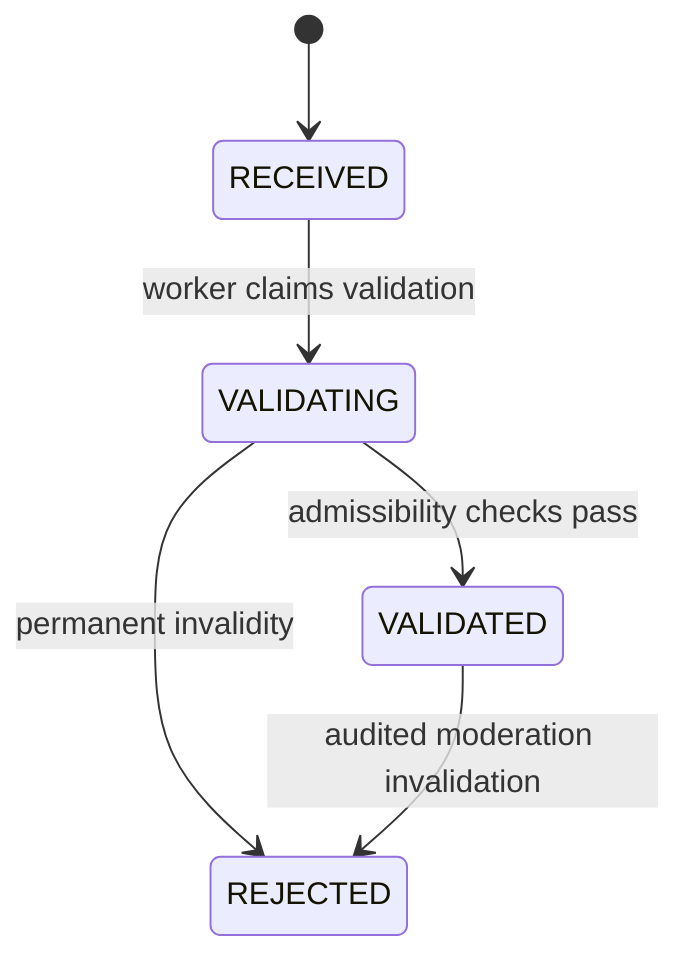

# Domain model and business rules

Status: planned v1. Existing Android BR-001…028 retain their meanings. New backend rules use `B-BR-*`; use cases use `BUC-*` to avoid collisions. No subscription field is an input to trust.

## Bounded contexts

- **Directory** — aggregate `Station`; entities `StationIdentifier`, `LocationRevision`; ports `StationCatalog`, `StationResolver`. CNPJ establishes business identity, UUID establishes platform identity. A rename is not a new station; CNPJ replacement requires explicit alias/merge review, never address-only automatic merging.
- **Official** — aggregate `ImportRun` and immutable `OfficialPrice`; `SurveyWeek`, `SourceRevision`; ports `AnpSource`, `OfficialRepository`, `StationResolver`. Imported values carry dataset checksum, row provenance and parser version. Only successful revisions are published.
- **Identity** — aggregate `Contributor`, entities `ContributorKey`, `Challenge`; ports `IdentityRepository`, `SignatureVerifier`. Anonymous means no traditional account, not untraceable or unique human.
- **Community** — aggregate `PriceObservation`, immutable votes and disputes; `ObservationDecision` append-only events, mutable current status projection; ports `ObservationRepository`, `StationResolver`, `TrustReader`, `EvidenceReader`, `ConsensusRepository`.
- **Evidence** — aggregate `UploadSession`, entity `EvidenceObject`; ports `ObjectStore`, `MediaValidator`. The database holds metadata only; private objects have bounded retention.
- **Trust** — aggregate `ContributorTrust`, immutable `TrustDecision`; port `TrustReader`. Reliability changes from independently reviewed outcomes, not payment or raw submission volume.
- **Moderation** — aggregate `ModerationCase`, append-only `ModerationAction`; ports to community/identity application commands. Reasons and actor are mandatory.
- **Later boundaries only** — Account linking, Subscription/Entitlement and Cloud Sync. No empty services, tables or speculative packages required now.

## Value objects

`StationId`, `ContributorId`, `ObservationId`, `EvidenceId`: UUIDs generated via injected ID source at application boundaries. `FuelPrice`: positive integer `amount_milli_brl` (1/1000 BRL), `currency=BRL`, `unit=L|M3|KG_13`. Initial representable range 1…1,000,000 milli-BRL; regional/product plausibility is a risk signal, not this structural bound. No float for monetary arithmetic. Standard deviation/statistical source fields may use exact decimal storage independent of FuelPrice.

`FuelProduct`: ETHANOL, GASOLINE_REGULAR, GASOLINE_ADDITIVED, DIESEL_S500, DIESEL_S10, CNG, LPG_P13. Fixed product-unit compatibility: CNG→M3, LPG_P13→KG_13, others→L. Legacy `GASOLINE_PREMIUM` maps only through a named Android adapter; it does not assert premium gasoline.

`Cnpj`: normalized 14 ASCII characters, first 12 uppercase alphanumeric and final two digits, official check-digit algorithm. Normalize approved punctuation only; never discard arbitrary letters. Preserve numeric legacy values and leading zeroes. Invalid source values go to quarantine. Do not use CNPJ as an integer or a UUID substitute.

`PriceCondition`: STANDARD, CASH, DEBIT, CREDIT, APP, LOYALTY, OTHER; conditional prices carry `qualifier_id` when an app/program/other restriction distinguishes eligibility. STANDARD forbids qualifier. Unknown condition is not STANDARD; OTHER requires explanation and is excluded from generic cheapest-price ranking. Unresolved qualifiers are observation-only until moderation maps them.

`Coordinates` validates latitude/longitude bounds; `GpsAccuracy` is nonnegative metres. `SurveyWeek` uses local calendar dates, inclusive range ≤7 days. Server timestamps are UTC instants; device capture timestamp is an untrusted claim. `Confidence`=LOW/MEDIUM/HIGH; `Availability`=AVAILABLE/DISPUTED/UNKNOWN; `Freshness`=FRESH/AGING/STALE. Separate concepts avoid overloaded states.

## Rules (GIVEN / WHEN / THEN)

- **B-BR-001 Provenance:** GIVEN official and community values, WHEN reading prices, THEN expose separate sources, dates, units and conditions; never fill a missing community field with official data.
- **B-BR-002 Exact money:** GIVEN an input amount, WHEN parsing, THEN reject floats/invalid range/product-unit mismatch, preserve exact milli-BRL and original ANP decimal text.
- **B-BR-003 Append-only facts:** GIVEN a persisted observation, WHEN correcting, THEN append a replacement with `supersedes_observation_id`; no price/location/evidence mutation of that fact. Personal-data deletion is governed by ADR-008, not blocked by this rule.
- **B-BR-004 Attribution:** GIVEN a signed write, WHEN authorizing, THEN derive contributor from the verified key, not a body-supplied ID; blocked/revoked keys cannot act.
- **B-BR-005 Idempotency:** GIVEN the same contributor and client submission ID, WHEN retrying, THEN return the same resource; a different payload conflicts. Request nonce and operation identity are different concepts.
- **B-BR-006 Independent support:** GIVEN a price key, WHEN counting support, THEN count at most one latest eligible vote per contributor in the window, no self-confirmation and no additional weight for multiple linked keys.
- **B-BR-007 Deterministic consensus:** GIVEN the same eligible facts, clock and policy version, WHEN rebuilding, THEN return the same result/explanation independent of input order.
- **B-BR-008 Freshness:** GIVEN an expired projection, WHEN serving or using cache, THEN expose STALE/UNKNOWN and exclude from current-price ranking, even if the worker is down.
- **B-BR-009 Payment isolation:** GIVEN identical facts/trust, WHEN entitlement changes, THEN confidence and ordering are unchanged.
- **B-BR-010 Evidence ownership:** GIVEN an evidence ID, WHEN attaching, THEN owner, ready/pending state and binding must match; a hash is not proof of ownership or location.
- **B-BR-011 Privacy:** GIVEN a public response/log, WHEN serializing, THEN no contributor identity, exact contributor GPS, IP, EXIF, private object key or signed URL is emitted.
- **B-BR-012 Moderation:** GIVEN a review action, WHEN changing eligibility, THEN append actor/reason/policy/event and enqueue recalculation atomically; do not edit raw price history.
- **B-BR-013 ANP revisions:** GIVEN identical source bytes, WHEN reimporting, THEN no duplicate revision; changed bytes create a new revision and preserve published history.
- **B-BR-014 Unknown location:** GIVEN an unverified station coordinate, WHEN validating proximity, THEN record UNKNOWN, never use a city centroid as a precise station position.
- **B-BR-015 Quotas:** GIVEN exhausted write/media quota, WHEN submitting, THEN reject before granting expensive work; no accepted command may be silently dropped.
- **B-BR-016 Retention:** GIVEN an expired personal-data record/object, WHEN cleanup runs, THEN purge its payload and record a minimal deletion outcome; replay after restore must not resurrect it.

## Observation state and related processes

Observation content is immutable. A separate sequence of decision events derives its validation state:

RECEIVED→VALIDATING requires a persisted command/job; actor worker; emits ValidationStarted. VALIDATING→VALIDATED requires station/product/ownership/admissibility checks; emits ObservationValidated and consensus job in one transaction. VALIDATING→REJECTED requires stable reason codes; emits ObservationRejected. VALIDATED→REJECTED requires a privileged reviewed case/reason; adds a revocation event and recomputes affected keys. REJECTED is terminal for that observation; appeal creates a new reviewed observation referencing it.

Worker retries/leases do not regress business state. Waiting for media/provider dependencies leaves VALIDATING with a processing reason; a missing-evidence timeout of 24 h rejects an explicitly photo-dependent submission. A deliberately metadata-only observation can validate with weaker evidence signals. No arbitrary state assignment in HTTP handlers.

Confirmation is a separate immutable vote; dispute is a separate OPEN→RESOLVED/REJECTED case. Neither pretends the original fact changed. Freshness is computed from receipt/eligibility policy; expiry does not rewrite historical observation state. Community projection may be AVAILABLE, DISPUTED or UNKNOWN and has its own version.

## Domain events

`StationRegistered`, `StationLocationRevised`, `OfficialRevisionPublished`, `ContributorRegistered`, `ContributorKeyRotated`, `PriceObserved`, `ValidationStarted`, `ObservationValidated`, `ObservationRejected`, `PriceConfirmed`, `ObservationDisputed`, `CommunityPriceChanged`, `ContributorTrustChanged`, `EvidenceVerified`, `EvidenceRejected`, `EvidenceDeleted`, `ModerationActionRecorded`, `PrivacyRequestCompleted`.

Each carries event ID, aggregate ID/version, occurred_at, policy version where relevant and a minimal non-sensitive payload. Event DTOs are owned by the publishing module. No full photos/GPS in general event payloads. Application interfaces are allowed for synchronous queries; durable jobs handle required asynchronous effects.
