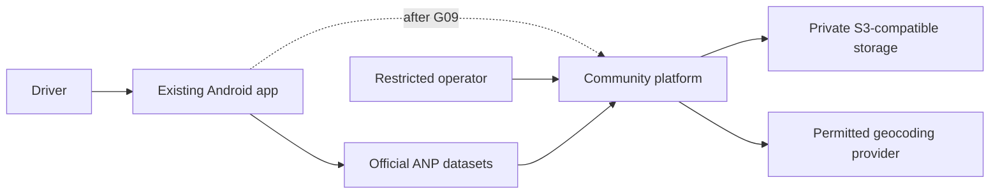
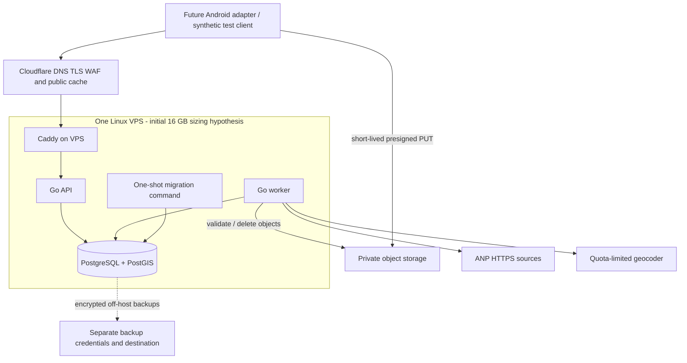

# Target architecture

Status: recommended implementation baseline. See [audit](../CURRENT_STATE_AUDIT.md), [ADRs](../ADR_INDEX.md) and [roadmap](../../ROADMAP.md). No backend executable exists yet.

## C4 context



## C4 containers and deployment



API and worker are two process roles built from one Go module and released from one commit/image family. They share business modules and one database. This is one modular monolith, not separately versioned station/price/user services. The migrator is a restricted deployment tool; the API role cannot run DDL.

## Stack and layout

Use Go, `net/http`, chi routing, pgx, sqlc, slog, explicit SQL migrations, PostgreSQL/PostGIS, Docker Compose and Caddy. S3 adapter permits R2 without coupling the domain to a vendor. Select supported versions, lock dependencies and pin container digests in P01; no `latest` production tags. Existing Android Kotlin/Compose/Room/WorkManager/Hilt/OkHttp stays in place.

```text
app/ application/ domain/ data/      existing Android modules
backend/
  cmd/api/ cmd/worker/ cmd/migrate/  composition roots
  internal/modules/
    directory/ official/ identity/ community/ evidence/ trust/ moderation/
      domain/ application/ adapters/   create only packages needed by a task
  internal/platform/                config, HTTP, database, jobs, telemetry
  db/migrations/                    ordered append-only SQL
  db/queries/<owner>/                explicit queries, per module sqlc output
  testdata/                         backend-only samples
contracts/openapi/                 versioned public API after P01
contracts/testdata/                language-neutral golden vectors
infra/                            Compose, Caddy, deploy/backup scripts after P01
docs/                             canonical plans, existing Android docs and ADRs
```

Go `internal` alone does not enforce every module boundary. CI must inspect imports: domain only stdlib; application depends on own domain and explicitly declared ports; adapters implement ports; only composition roots wire other modules' public application interfaces. No module imports another module's adapters or generated SQL package. Cross-module joins require an owned read query documented in DATA_MODEL, not arbitrary handler SQL. A shared kernel contains only stable IDs/price primitives, not an all-purpose business package.

## Components, ownership and flows

Directory owns canonical stations and location provenance. Official owns ANP input/revisions and immutable prices. Identity owns contributors/keys and challenges. Community owns observations/votes/disputes/consensus/projections. Evidence owns upload sessions/objects and retention. Trust owns versioned reliability signals. Moderation owns cases/actions/audit and invokes application commands; it cannot edit raw facts.

Read: public handler → query use case → directory and official/community read adapters → DTO with distinct `official` and `community` sections. A GET reads indexed projections; it does not replay all history, call OCR, or geocode synchronously.

Write: limits → identity/signature → use-case authorization → domain invariants → short DB transaction recording fact, decision event, idempotency result and required job → response. Validation/consensus are asynchronous, with status visible to the owner. No external HTTP call while holding row locks.

Upload: request authorization → private upload session/quota → direct presigned PUT → finalize intent → worker HEAD/GET with bounded decode → trusted hash and sanitized server-owned object → READY → validation of linked observation. Upload completion from the client is not proof of valid content. Details in [security](../security/SECURITY_PRIVACY.md).

## Transactions and jobs

PostgreSQL jobs are necessary for evidence processing, ANP imports, consensus and retention. Queue insert is atomic with the business write; this is the durable delivery mechanism, with no second broker/outbox added initially. Events are facts; jobs request work. A pure in-process event notification alone must never carry a required post-commit effect.

Claim due work with `FOR UPDATE SKIP LOCKED` in a short transaction, set lease/attempt/token, commit, execute, then acknowledge with the matching fencing token. Lease: 60 seconds, heartbeat 20 seconds; configurable by job type. On crash, lease expiry allows replay. Handlers deduplicate by business key/version; stale workers cannot overwrite a newer result. Retry transient failures up to 5 attempts with bounded exponential backoff (15 s to 15 min, jitter outside domain); invalid input terminates immediately. Exhaustion → DEAD plus alert and operator replay command with reason. Defaults are test hypotheses, configurable and versioned.

Consensus serializes per `(station, fuel, unit, condition, condition qualifier)` using a stable lock row created with ON CONFLICT; acquire it before selecting eligible votes and committing the versioned projection. Reads use MVCC. Expiry jobs and query-time expiry ensure worker outages cannot make old data appear current.

## Consistency and caching

Write acceptance is immediate; validation/projection is eventually consistent. Initial target: p95 projection delay ≤30 seconds at the acceptance load. Owner status is `no-store`. Public station responses: ETag, `max-age=30`, `s-maxage=60`, bounded by `expires_at`. Edge cache needs explicit rules and tests; headers alone do not prove caching is active. No caching of signatures, identity, evidence URLs, disputes or admin responses. Nearby exact-coordinate requests use `no-store`; a coarse public cell endpoint is a later optimization if needed. Cache only coarse public inputs, never exact user locations in shared cache keys/logs.

## Offline and failure isolation

Android keeps its ANP ingestion/cache through P10. Community additions are local cache records and an explicit outbox with stable client submission IDs. A failed backend never clears local ANP, vehicles or preferences. Community rows age locally using server timestamps/expiry, and read as stale/unknown when expired. A queued old observation is not silently retimestamped as a recent capture. Retries use the same command identity with a fresh authentication challenge.

DB failure: no accepted writes, readiness false; liveness remains process-only. Storage failure: affected evidence remains pending, no fabricated verification. ANP/geocoder failure: last published data remains, with its original dates/quality. Client contributions cannot set catalog coordinates. See [operations](INFRASTRUCTURE_PLAN.md) for full failure recovery.

## Scaling boundaries

Stage 1: one VPS, persistent DB disk, external object storage/backups, API stateless. Stage 2: dedicated database only after sustained measured resource/latency pressure. Stage 3: multiple API replicas and measured worker scaling; authoritative writes/nonces/limits remain in PostgreSQL. Replicas need explicit consistency policies. No Redis, Kafka, Kubernetes, NATS, RabbitMQ, Elasticsearch, MongoDB or service mesh without an ADR linked to measured bottlenecks.

The use of SKIP LOCKED for queue consumers follows [PostgreSQL SELECT documentation](https://www.postgresql.org/docs/current/sql-select.html); it is not a general-purpose consistency mechanism.

## Planned extension contexts (2026-09-30)

P13 account access binds private provider subjects/session families to existing contributor keys through proof ports; P14 station/fuel feedback owns stars, text revisions, replies, validity votes and rebuildable aggregates separately from price consensus. P15 native media ports feed bounded backend sanitization and all-copy 24-hour expiry; P16 location risk ports feed independent proximity validation. Existing Go modular monolith/PostGIS/jobs remain; no speculative service split. Shared Kotlin domain/application and Android/Swift adapters follow ADR-015. Each extension freezes additive wire/schema contracts and failure tests before implementation; none exists merely because this map names it.
