# abastevo commercial community delivery plan

State: **PLANNED**, 2026-10-01. Authority: maintainer requested a commercial, easy-to-use community app, ANP as reference, new brand/organization, explicit iOS archival and wiki Home alignment. [Product specification](../product/COMMUNITY_EXPERIENCE.md) defines B-BR-C01–C06 and BUC-C01–C05; [ADR-016](../adr/016-android-commercial-community-ios-deferred.md) defines platform/release scope. No future phase is implemented by this document.

## Current evidence and prerequisites

P09/G09-LOCAL and P12–P17 local functional modules are integrated. PR #67 (`9c090c6`) integrated P18 local tests/security/performance baselines, with two Android instrumented regression tests passing. That is not a complete device matrix, cold-process performance result or production certification. Full G18 remains NOT_ACCEPTED; issues #60–#62 preserve outstanding evidence. iOS is [archived](archive/IOS_DEFERRED.md), explicit resumption only.

P00-T04 adopts the approved A icon; P00-T05 delivers this plan and Home alignment. Current data/connection edits in another checkout are not part of this batch. Commercial implementation starts P19 only after its own authorized opening and baseline audit. Existing P13–P16 rules are reused, not rebuilt from scratch.

## Order and architecture

```mermaid
flowchart LR
  A[Integrated local backend and Android modules] --> B[P19 Product and identity foundation]
  B --> C[P20 Community price discovery]
  C --> D[P21 Photo contribution journey]
  D --> E[P22 Social experience and moderation]
  E --> F[P23 Community operations and retention]
  F --> G[P24 Android commercial acceptance]
  G --> H[P09 G09 Android and backend production certification]
  H --> I[P10 T09 bounded public pilot]
  I --> J[P11 separately validated optional paid benefits]
```

Native iOS implementation/acceptance is parked outside this path. Preserve pure Kotlin domain/application and explicit Android/Go adapters; retain package `com.anpfuel`, existing modules, exact-money/source contracts and MIT notices. Backend remains a modular monolith; do not add microservices, speculative feed infrastructure or dependencies without recorded need/license/security review. New indexed/paginated read models or subscriptions are added only for measured use cases, with contracts/negative authorization/real-PostGIS tests before app integration.

## Phase tasks and acceptance

Every task below has a stable ROADMAP anchor. At opening, record exact affected paths, existing commands, B-BR/BUC, fixtures and risk class. Split an oversized task into bounded letter-suffixed slices before coding. No future issues/milestones are opened by this planning publication.

### P19 — Product and identity foundation

Entry: integrated current local modules and approved identity. Exit **G19**: commercial journey/navigation contracts, theme/component baseline and preserved-feature mapping accepted; no claim of complete new UX.

- **T01:** inventory actual implemented screens/contracts and inherited features, audit supported Kotlin/Compose/Android pins against current official sources, reconcile P18 gaps and document manual usability baseline. Preserve modules/three free vehicles/offline tools. No unneeded upgrade merely for novelty.
- **T02:** freeze community primary states, dated ANP fallback, price condition/source hierarchy, guest/account and permission journeys; prototype Explorar/Comunidade/Perfil plus Atualizar preço. Test comprehension with representative novice drivers and maintainers, record observations without PII; revise navigation before coding. A maintainer-approved prototype is possible early evidence, not a substitute for novice testing.
- **T03:** implement scoped Android identity/theme tokens, app display name and accessible reusable states/components. Keep business rules outside UI; meaningful state/render/semantics/font-scale checks and affected resource compilation.
- **T04:** migrate the navigation shell with preserved expert tools and deep-link/back-state behavior; test offline/auth/permission interruptions and no lost legacy feature. Record validated journey and next integration scope.

### P20 — Community-first price discovery

Entry G19. Exit **G20**: real community current-price browsing and station detail work against local backend, with source/freshness/condition/accessibility/offline truth.

- **T01:** document additive discovery/read-model contract only where existing APIs fall short: station/fuel current projection, pagination/sort/freshness/condition semantics. Reuse existing consensus and bounded indexed queries. Immediate real-DB ties/concurrency/pagination/money/source and anonymous-read/private-field negative tests; benchmark realistic fixture scale before adding indexes.
- **T02:** implement Android Explorar list-first city/fuel/search/filter/sort; optional map only after provider/dependency/privacy audit. Demonstrate manual city and no mandatory account/GPS; preserve stable pagination/filter state and failed-refresh cached data.
- **T03:** implement station detail cards, route/update actions, dated secondary ANP/history and explicit unknown/stale/disputed states. Test conditional prices, no community coverage, old cache and screen-reader source/condition labels.
- **T04:** scoped end-to-end discovery and legacy tools regression; validate a novice can identify source, recency and applicable price without confusing ANP/reference with community state. Record command/candidate/evidence, not fake coverage.

### P21 — Photo-led contribution journey

Entry G20. Exit **G21**: capture/review/submit/status works on supported Android hardware with private transient evidence, truthful publication states and robust retries.

- **T01:** freeze contribution presentation/state contract and retention boundary. Keep optional-evidence legacy API compatible; document any future mandatory-photo decision separately. Tests distinguish queued/pending/accepted/disputed/rejected; server timestamps and consensus remain authoritative.
- **T02:** integrate camera and existing lightweight encoder/OCR with editable fuel/price/condition review, legibility feedback and minimal permissions. Measure encoding time/peak heap/file size on supported lower-end device; reuse P15 budgets. Backend revalidation rejects malformed/oversized payloads/decompression abuse and strips metadata with failure-path tests.
- **T03:** integrate resumable authenticated/anonymous-proof-compatible submission and private owner status, stable outbox IDs, cancellation and retry. Test network loss, duplicate/concurrent delivery, token expiry, stale drafts, app restart and location DENIED/UNKNOWN/SIMULATED without silent publication.
- **T04:** close P18's outstanding Android/local private-storage matrix: real S3-compatible local service, object/upload/cache/temp/retry/backup restore and clock-expiry checks. Verify all owned copies and access expire within 24h and deletion failures remain visible/retryable. Fix unavailable emulator prerequisite before claiming this task; no real production photo fixtures. Real-provider proof still belongs to G09.

### P22 — Social experience and moderation

Entry G21 and existing P14/P17 contracts. Exit **G22**: free-account social flows and moderation work safely at station/fuel level; no purchased trust.

- **T01:** integrate progressive free signup/login/recovery/provider callbacks and account deletion/export/secure session handling into the new UX. Negative owner/session/linking/rate-limit/provider tests immediately; real Android provider evidence required, mocks insufficient.
- **T02:** integrate 1–5 personal stars, 280-character comments/one-level replies and revision-bound valid/invalid votes. Show agreement denominator/no-votes state independently of price confidence. Test Unicode, author vote denial, unique vote/change replay, concurrent edits, revoked accounts and hidden/removed content.
- **T03:** implement accessible report/moderation/status/support journeys and a bounded operator workflow using existing controls. Record reporting policy/review/appeal authority and staffing; if a block/mute mechanism is added, first define its visibility scope/rights/deletion and API, then test authorization. Reports never auto-delete content.
- **T04:** abuse/lifecycle/offline integrated social acceptance: spam limits, report replay, revision conflicts, erased contributor, cached removed content and private owner access. Real PostGIS for changed queries/jobs, and no PII/photo/GPS logs. Preserve auditable operator actions.

### P23 — Community operations and sustainable participation

Entry G22. Exit **G23**: bounded-city pilot preparation, useful opt-in return flows, support/moderation/privacy operations and honest metrics ready locally; no public pilot yet.

- **T01:** reuse local favorites; define measured need for optional follows and city/station activity subscriptions. If implemented, specify backend ownership/unsubscribe/erase/pagination before client. Test no private-field leak, stale price, denied notification, duplicate alerts and unfollow/deletion; no endless feed or ranking incentives without evidence.
- **T02:** create plain-language contributor onboarding, safety/legibility/condition guidance, moderation/community rules and help/report channels. Draft invite flow only if needed; prevent identity exposure and invite spam. Do not simulate real people/content.
- **T03:** freeze aggregate metric definitions/purpose/retention and minimal collection; validate consent where required and deletion/aggregation. Define low-coverage city handling and a staffing/capacity/moderation checklist, costs from measured utilization, no invented budget.
- **T04:** rehearse a synthetic bounded-city lifecycle locally with real anonymous/account contributors represented by test fixtures: onboarding, contribution, correction, report, follow/notification if implemented, erase/export and no-coverage recovery. Write operator runbooks and unresolved pilot risks. Evaluate optional business hypotheses; P11 alone implements paid benefits.

### P24 — Android commercial acceptance

Entry G19–G23 integrated, all required P18 Android/backend gaps resolved. Exit **G24-ANDROID-COMMERCIAL**: pinned Android functional candidate accepted; iOS remains deferred and real G09 remains uncertified.

- **T01:** freeze support matrix, exact device/API/OEM coverage, complete inherited/new feature matrix and candidate SHA. Include free providers, money/source/condition, OCR/outbox, votes/moderation, photo expiry, real local storage, denial/unknown/mock GPS, offline and erasure. Required missing/failed proof blocks acceptance.
- **T02:** actual novice usability/accessibility campaign: first successful price lookup, comprehension of references/conditions, photo contribution without assistance, readable large fonts and screen reader. Define sample, task protocol, pass thresholds and remediation based on P19 baseline before running; collect no unnecessary PII. A screenshot or plan is not acceptance.
- **T03:** profile genuine cold-process start, list/map scrolling if implemented, peak heap/encoding/OCR, background/offline replay and battery on the frozen low-end/support devices with realistic fixtures. Freeze budgets before optimization; preserve P15 evidence limits. The earlier cached-home 382ms test is only regression evidence, not a cold-start result.
- **T04:** close security/compatibility/privacy/signature/location failure matrices and produce signed-off Android-only manifest with no missing rows. Run specialized exit once, then protected quick integration once on current head/base. G09 still needs real-provider/TLS/restore/load/launch evidence; no public release follows this local phase automatically.

## Delivery cadence and practical commands

Each current phase opens one milestone/draft PR and `codex/phase-NN-slug`; each bounded task owns one issue/atomic commit. Use a worktree if the checkout is occupied. Contracts first, domain RED → GREEN → REFACTOR; reuse existing test fixtures/ports and keep feature/state tests meaningful. Do not write tests that only mirror theme constants or generated asset filenames.

For Android changes, select affected `:domain`, `:application`, `:data`, `:app` test/compile tasks from the existing Gradle build and record the actual selected commands; use `:app:assembleDebug` for launcher/resources and relevant instrumentation for native behavior. Backend changes follow [TEST_STRATEGY](../backend/TEST_STRATEGY.md) and evidence-backed [backend commands](../../backend/README.md), with immediate critical auth/privacy/money/SQL/real-PostGIS/concurrency checks. Descriptive future gates must acquire executable, proven entry points in their owning tasks, not invented command names.

Every task runs `git diff --check` and scoped secret review. At phase closure, specialized exit checks once → actual `scripts/git-flow.sh finish --required "Quick verification" --pr <number>` → current-head/base guarded merge preserving task commits → wiki from merged SHA once. Missing/failed/skipped checks block merge. No duplicate aggregate before finish, no full production suite for every screen, no force push/admin bypass. A wiki failure is WIKI_PENDING and retries documentation only.

## Release, pilot and commercialization

After G24, **P09/G09** certifies the full Android/backend immutable real-production candidate, with all account/social/media/location extensions and no waived environment/provider checks. Owner must separately authorize actual deployment/tag/pilot. **P10-T09** then validates a bounded real city with staffed moderation, truthful coverage, measured acquisition/retention and stop/rollback criteria. **P11** explores and implements only validated optional paid convenience with its own billing/provider/rights/certification. Existing IDs are preserved; do not duplicate these release phases as new P25/P26 services.

Risks: sparse community data, misleading price conditions, premature trust, device encoding cost, photo-retention failure, abusive comments, provider lock-in and unpaid moderation load. Owning phases resolve them with state clarity, measured hardware/storage tests and a bounded launch. Unknowns stay explicit. iOS return is never scheduled automatically.

Recovery: additive contracts preserve v1, data migrations are append-only with recovery tests, legacy expert tools remain reachable, new flows can revert without destroying contribution history, and failed release candidates are replaced with newly tested candidates. No destructive reset or waiver of known failures.
