# National station catalog expansion delivery plan

State: **PLANNED / LOCAL_ONLY**, 2026-10-02. Authority: maintainer requested a plan to implement researched national station-discovery alternatives. No runtime implementation, issue/milestone creation, PR, GitHub push, wiki publication, procurement or deployment is performed by this planning batch. Canonical tasks: [ROADMAP P25–P29](../../ROADMAP.md#station-catalog-expansion). Target rules/use cases: [STATION_CATALOG](../product/STATION_CATALOG.md). Current implementation state remains in [PROGRESS](PROGRESS.md).

## Outcome and boundaries

Discover fuel retailers independently of ANP price-survey coverage. Build a national Directory catalog, verify identities/authorization, keep location quality explicit and let free-account users suggest missing stations. Stations without a price remain useful catalog entries; community prices and dated ANP prices keep their separate meaning.

Deliver core sources first: ANP registry CSV/API, DOU regulatory-change discovery and community submissions. OSM, direct partner feeds, owner representation and paid POI providers are evaluated behind explicit need/license/contract decisions; they are not speculative services or unconditional launch prerequisites.

Do not promise that every physical inauguration is discovered in 1–2 days. Company creation, authorization publication and actual opening are distinct. Proposed internal objective: eligible records appear within 24 hours normally, with a 48-hour escalation threshold. This is a design objective to validate, not a provider SLA or a passed gate. P25-T01 freezes eligibility and clocks; P29 tests throughput and measures actual source/review delay before any commercial claim.

## Evidence and researched source choices

Primary references checked 2026-10-02; reconfirm behavior, access and rights at the owning task's opening.

- **ANP survey:** a sample of stations, not the national inventory. [Survey explanation](https://www.gov.br/anp/pt-br/assuntos/precos-e-defesa-da-concorrencia/precos/precos-revenda-e-de-distribuicao-combustiveis).
- **ANP registry CSV:** official data for revendedores in operation, with daily frequency declared in its metadata. Publication frequency does not establish physical-opening-to-feed latency. Use an initial full import and daily complete reconciliation. [Dataset](https://www.gov.br/anp/pt-br/centrais-de-conteudo/dados-abertos/dados-cadastrais-dos-revendedores-varejistas-de-combustiveis-automotivos), [metadata](https://www.gov.br/anp/pt-br/centrais-de-conteudo/dados-abertos/arquivos/arquivos-dados-cadastrais-dos-revendedores-varejistas-de-combustiveis-automotivos/metadados-revendedores-varejistas-combustiveis-automoveis.pdf).
- **ANP API:** general or CNPJ/UF/municipality queries; coordinates when available, cadastral/product/status information. A limited Sorriso/MT query returned HTTP 200 and 25 records during research. That is availability evidence for one query, not sustained performance, national completeness or freshness certification. Preserve CRS/accuracy/source metadata rather than treating every returned coordinate as reviewed. Verify numeric/alphanumeric CNPJ compatibility and pagination. [Official API announcement](https://www.gov.br/anp/pt-br/centrais-de-conteudo/paineis-dinamicos-da-anp/paineis-dinamicos-do-abastecimento/painel-dinamico-de-relatorio-de-revenda), [Swagger](https://revendedoresapi.anp.gov.br/swagger/index.html), [manual](https://www.gov.br/anp/pt-br/centrais-de-conteudo/paineis-dinamicos-da-anp/paineis-dinamicos-do-abastecimento/api-revendedores-manual-usuario.pdf).
- **DOU INLABS:** daily XML/PDF after publication, with account access; XML is not a replacement for the certified publication. Parse ANP acts and verify their reference before reconciliation. Potential earlier discovery than another feed is a hypothesis to measure. [INLABS](https://inlabs.in.gov.br/acessar.php), [open data](https://www.gov.br/imprensanacional/pt-br/acesso-a-informacao/dados-abertos).
- **Community/owners:** proposed product intake, not an existing nationwide external feed. Free-account submissions require verification, bounded review and private status. A public CNPJ is not owner authentication; owner representation is an optional separately proven feature.
- **OSM:** candidate geometry/addresses with variable coverage; Brazilian bulk extracts are available. Account for ODbL attribution/derived-database obligations before integration. The public editing API is not national bulk-query infrastructure. [Brazil extracts](https://download.geofabrik.de/south-america/brazil.html), [license](https://www.openstreetmap.org/copyright), [API policy](https://operations.osmfoundation.org/policies/api/).
- **Partners/commercial POI:** a contractual option, not an available universal opening feed. Require explicit persistence/redistribution rights and tested update semantics. Google Places restricts caching/storage except permitted exceptions such as place IDs; do not copy it into an unrestricted permanent inventory. [Places policies](https://developers.google.com/maps/documentation/places/web-service/policies).

An active CNPJ does not prove ANP authorization or physical opening. Optional Receita/Serpro checks may support business identity after access/need review; they do not replace station authorization. No national SEFAZ receipt API or paid data provider is assumed available, purchased or licensed.

## Order, current phase and release gates

2026-10-05 sequencing override: [ADR-019](../adr/019-android-vps-integration-first.md) prioritizes [P34–P38 Android/VPS source integration](ANDROID_VPS_PLAN.md) before this expansion. Preserve all IDs; P27 extends existing P35 Directory UUID/cache and P36/P37 social/contribution consumers instead of rebuilding them. ADR-018 local source checkpoints supersede per-phase PR/CI/merge waits; end Android manual/device evidence remains OWED until all selected construction phases finish.

The newly requested [station profile plan](STATION_PROFILE_PLAN.md) adds P30 → P31 → P32 → P33 after G29 and before P09/G09 for that selected feature. It supersedes optional P28-T04; P28-T01–T03 remain source/partner complements. The catalog diagram below includes the new profile handoff; its full phase/release sequence is in the linked plan. No duplicate representation implementation or unchanged-candidate acceptance is inferred.

Historical planning context (2026-10-02): P24 was occupied by Android acceptance. This plan originally used a separate local planning branch from cached `origin/main b4f664e`; do not modify its device tests, candidate or evidence. Actual entry requires verified current base and phase gates, not this cached snapshot. Preserve P19–P23 integration and historical G18_NOT_ACCEPTED; native iOS remains DEFERRED_EXPLICIT_RESUME_ONLY.

```mermaid
flowchart LR
  A[P34-P38 Android VPS source integration] --> B[P25 ANP national registry]
  B --> C[P26 DOU change discovery]
  C --> D[P27 Account suggestions and Android catalog]
  D --> E[P29 Catalog capacity and updated Android acceptance]
  D -. selected source only .-> F[P28 Optional complementary sources]
  F -. if enabled in candidate .-> E
  E --> P[P30 to P33 selected station profile scope]
  P --> G[P09 G09 scoped production certification]
  G --> H[P10 T09 public pilot]
  H --> I[P11 optional paid benefits]
```



Current core source execution: **P34 → P35 → P36 → P37 → P38 code-ready → P25 → P26 → P27 → P29 code-ready → P30 → P31 → P32 → P33 code-ready → end Android manual/device acceptance → final cumulative integration → P09/G09 → P10-T09**. P11 remains optional. P28 has an explicit selection gate and can run later with its own affected acceptance/release. Phase numbers identify ownership, not mandatory numerical order. If a P28 adapter is enabled in the candidate, integrate its selected tasks and include its risks in P29/G09. An unavailable optional source does not block launch when it is excluded explicitly.

G24 evidence remains valid only for its tested inputs. P27/P28 changes produce a new Android/backend candidate: P29 carries forward applicable unchanged proof and reruns affected functional/device/accessibility/performance/security rows. Missing required rows block acceptance; an old G24 pass cannot certify changed flows. Existing P09 owns the final real-production matrix; no new release phase, production authorization or iOS resumption is introduced.

## Architecture and data ownership

Keep the existing Go modular monolith, PostgreSQL/PostGIS and durable database jobs. No Kafka, separate catalog service, new database, paid geocoder or national request-per-station crawl by default.

Source adapters feed staged assertions owned by **Directory**; a deterministic application verifier reconciles them against stable station IDs. Source runs carry checksums/parser versions and completeness markers. Persist business intent and its deduplicated job atomically; leases/fencing prevent stale workers from publishing. Reuse platform jobs and existing geocoder/moderation/evidence ports, extending narrowly where current contracts are insufficient.

Proposed logical additions, finalized in P25-T01/P27-T01 before migrations:

- Source runs/checkpoints: scope, edition/snapshot identity, checksum, parser version, complete/failed/quarantined state, counts and safe error codes.
- Source assertions/revisions: stable source key, station ID if resolved, structured address/status/location metadata, source/effective/fetch dates and supersession. Do not copy arbitrary provider records into public responses.
- Canonical identifiers: reuse CNPJ history; introduce SIMP/authorization identifiers only with proven scope/uniqueness. New source identity does not replace the platform UUID.
- Independent authorization/operation/publication projections, source freshness and reviewed location revisions. These do not reuse price confidence or rating agreement.
- Private station suggestions and decisions: owner attribution, stable submission ID, structured proposal, evidence reference and minimal review history with privacy retention. No new tenant model or permanent contact-document archive.

Use append-only applied migrations, expand/backfill/validate/contract and previous-schema upgrade/recovery proof. Source assertion staging must not expose partially processed national snapshots. Small verified API/DOU/candidate changes may publish through their own atomic application transactions; a later snapshot must not overwrite them without reconciliation. No station deletion or identifier reassignment on a single missing row.

Directory list/detail reads must work without price rows. The Android discovery flow currently reuses legacy ANP/price data and has a documented CNPJ→UUID social-target gap. P27 explicitly owns migration of the affected catalog consumer: server UUID-backed station DTO/cache, bounded city/name reads, nullable price sections, safe full-CNPJ resolution and offline compatibility. Do not claim that importing server stations alone makes them visible in the app. Preserve free offline expert tools, exact money, fuel/condition semantics and social write proof.

## Source schedule and verification policy

Initial schedule proposal, finalized after provider-contract checks: one complete CSV reconciliation per day; incremental API lookups for newly reported/changed CNPJs; DOU discovery after editions are available plus bounded catch-up for missed editions. Do not poll every station hourly. Global per-source quotas, caching where permitted and bounded jitter/backoff apply; pagination/page-byte limits are explicit.

Fresh CSV/API data can automatically resolve an exact valid identity/address/status match only after a versioned publication policy has been frozen and tested. Unknown headers, invalid CNPJ, status conflicts, unsupported CRS, ambiguous address/geometry or unexpected national deltas quarantine the affected run/record. Numerical source thresholds must be calibrated from representative data in P25, not copied blindly from price XLSX imports.

DOU grants feed authorization assertions; they do not prove operating date or override explicit later revocation. Normalize act/edition dates and correction chains; preserve ambiguous text for restricted review with bounded retention. Unknown language cannot become a guessed authorization.

P27 public behavior starts conservatively: private pending suggestion, official exact-match verification or authorized review, then eligible catalog entry. A review-approved unverified entry requires its own frozen explicit visibility policy and honest labels; no default publication of an arbitrary pin. Suggestions from users at the same station may correlate and are not independent legal proof.

## Phase outcomes

### P25 — National ANP registry and canonical publication

Entry: P38 source checkpoint and current Directory/account/price baseline reconciled; required end manual/device proof remains owed. Branch: `codex/phase-25-national-registry`. Exit **G25**: CSV/API discovery and canonical publication pass scoped failure/concurrency/PostGIS/contract tests; zero-price stations are queryable on the server; provider limits/freshness unknowns are explicit.

T01 freezes source schemas/status/date/coordinate policy, privacy inventory, field rights and fixtures. T02 adds bounded CSV staging. T03 adds paginated/targeted API adapter. T04 reconciles identities/status and additive public DTOs without price joins or fabricated geometry. T05 runs the job/recovery/source-health acceptance and operator controls. No Android consumer change in P25.

### P26 — DOU regulatory-change discovery

Entry: G25. Branch: `codex/phase-26-regulatory-discovery`. Exit **G26**: authenticated bounded XML/PDF discovery, deterministic act classification and audited reconciliation with catch-up/republication/revocation failure proof. Missing source access prevents this gate; record the gap rather than pretending discovery runs.

T01 freezes access/rights/edition fixtures and adapter. T02 parses relevant ANP acts, resolves identity and chronology through Directory. T03 validates ambiguity/recovery and provides an operator review/runbook. No national inauguration SLA, automatic public grant of legal status from free text or owner-account creation.

### P27 — Free-account station intake and Android visibility

Entry: G26 and existing P13/P15/P16 moderation/security gates. Branch: `codex/phase-27-station-intake`. Exit **G27**: signed account intake, owner-only status, audited verification and Android catalog/suggestion flows pass targeted backend and device checks, including zero-price stations and canonical social targets.

T01 implements structured signed backend suggestions and private status. T02 implements exact official-match verification, bounded manual decisions/corrections and reviewed location with existing evidence expiry. T03 integrates server Directory UUIDs/catalog reads into Kotlin/Android discovery/cache and affected existing social/contribution targets. T04 implements lightweight suggestion/correction/status UX, progressive permissions and offline replay. T05 proves abuse, privacy, concurrent resolution, expiry, revoked-session, account erasure and offline end-to-end behavior. Backend endpoints integrate before their app consumers.

### P28 — Optional complementary coverage

Entry: G27 plus a measured gap and an explicit source-selection decision. Branch: `codex/phase-28-catalog-complements`. Exit **G28** applies only to selected task ranges: rights/access accepted, implemented adapter/representation scope tested, provenance/attribution correct and disable/recovery demonstrated. Unselected tasks remain DEFERRED, never marked complete.

T01 evaluates OSM/POI rights, coverage/cost and provider dependency; select none if the core sources suffice. T02 implements only the selected licensed geometry/candidate adapter. T03 implements a bounded authenticated feed only with a real partner agreement. Historical T04 is SUPERSEDED_BY_P30_P33 after the explicit profile request; representation now has its own required proof/privacy/lifecycle scope. Record each independently selected range before coding; no catch-all multi-provider service or unlimited owner editing authority.

### P29 — Catalog scale, freshness and candidate acceptance

Entry: G27 plus all P28 source/partner tasks actually enabled in this candidate (T04 superseded); unchanged G24 evidence mapped to inputs. Branch: `codex/phase-29-catalog-acceptance`. Exit **G29-CATALOG**: scoped load/recovery/security/privacy and new Android device/compatibility acceptance complete; SLO/report limitations documented. Real edge/TLS/storage/provider/restore production certification still belongs to P09/G09.

T01 freezes then executes capacity/freshness/review-backlog scenarios. T02 proves synthetic source→catalog→app→price/social lifecycle and reaccepts affected Android/device/accessibility/performance rows. T03 produces the pinned candidate manifest, operational runbooks and G09/P10 handoff. A local simulation is not a live national SLA or real-production proof.

## Capacity, latency, operations and cost

Initial **synthetic sizing hypotheses**, not estimates of actual national station count or measured capacity: 100,000 canonical stations, 10,000 novel assertions in 24 hours, a burst of 1,000 candidate inputs in 10 minutes, concurrent reconciliation/read/write traffic and a 48-hour dependency outage followed by catch-up. P25-T01 records resource/query/queue budgets before implementation; P29-T01 freezes workload/hardware/limits before its campaign. Source requests use fixtures/sandbox for load, never hammer national public endpoints.

Measure import rows/second, peak heap/temp bytes, transaction time/locks, API p95/error rate, indexed query plans, queue age/lease expiry, source last-success age, publication lag and manual-review throughput. Freeze acceptance ceilings before the measured campaign, including no regression beyond agreed existing read budgets. Require all expected inputs accounted as accepted, duplicate, rejected or unresolved; no silent drops, duplicate platform identities or partially published runs. National scale is accepted only at the frozen measured workload/configuration.

Separate `source_published_at`, `first_observed_at`, `eligibility_established_at` and `catalog_visible_at`; backdated dates cannot fabricate a measured fast discovery. If physical opening time is unknown, its lag is unknown. For the internal 24/48-hour goal, report numerator/denominator, percentiles, outage windows and unresolved cases; do not redefine eligibility after observing bad results. Staff manual-review demand as arrival rate × handling time; 10,000 exact official matches and 10,000 ambiguous suggestions have very different labor costs.

Operator controls: pause/resume each source; verify last accepted revision; inspect redacted quarantine; retry one bounded run/checkpoint; review duplicate/succession/location conflicts; roll back a projection pointer safely; distinguish explicit closure from stale source; preserve deletion ledger during restore. A failed optional provider remains disabled and last-good public facts show freshness. On-call escalation for >24-hour eligible backlog; unresolved >48-hour items need actionable cause/status, not fake acceptance.

Cost evidence records bytes/storage/CPU/network, allowed provider calls/quotas, paid licenses if selected, S3 image bytes × 24-hour retention and staff handling time. No currency estimate or paid procurement is invented in this plan. Keep billing outside verification priority/trust.

## Test and delivery contract

Every task declares B-BR-D/BUC-D, exact changed files, risk and executable commands at opening. Domain RED → GREEN → REFACTOR with fixed clocks/IDs. Critical SQL, jobs, privacy, account proof and lifecycle changes require immediate negative/failure/concurrency/real-PostGIS tests, not just phase exit. Use [TEST_STRATEGY](../backend/TEST_STRATEGY.md), [backend invocation/environment](../../backend/README.md), [CI_PLAN](CI_PLAN.md) and [DELIVERY_WORKFLOW](DELIVERY_WORKFLOW.md).

Existing command building blocks (choose relevant ones; new commands/packages must first be implemented and evidenced):

```sh
# From backend/, actual changed Directory tests and affected consumers:
go test -race ./internal/modules/directory/...
go test -race -tags=integration ./internal/modules/directory/...
go test ./internal/platform/apicontract/...
# From repository root, after disposable DB/env setup in backend/README:
bash scripts/check-compat.sh
vacuum lint -r contracts/openapi/vacuum-rules.yaml contracts/openapi/v1.yaml --no-update-check
./gradlew :domain:test :application:test :data:testDebugUnitTest :app:testDebugUnitTest
./gradlew :app:assembleDebug
./gradlew :data:connectedDebugAndroidTest :app:connectedDebugAndroidTest
git diff --check
```

Select account/evidence/moderation/privacy/platform job suites when affected; Directory-only proof is insufficient for cross-module writes. For new SQL run empty/previous-schema migration, recovery and actual PostGIS transaction/EXPLAIN cases. Unit tests use deterministic fixtures; live source smoke is separate and never a flaky unit-suite dependency. No native iOS builds or invented passed provider/device rows.

Required fixture cases: valid/invalid numeric and alphanumeric CNPJ, leading zeros, same station across CSV/API/DOU, different nearby stations, succession, corrected/revoked act, identical/changed source replay, page failure/reordering/duplicates, malformed/oversize CSV/JSON/XML, unsupported CRS/centroid, conflicting chronology, 429/timeout/backoff, worker kill/lease/fencing/DB failure, abusive/revoked/foreign-account input, owner-status IDOR, media expiry/rebinding, privacy erasure/restore, no-price/no-location app rows, stale offline replay and old-client enum fallback.

One phase milestone/draft PR/`codex/phase-NN-slug`; one issue and atomic task commit. Create actual remote records only at the authorized phase opening, after reconciling existing IDs. Per-task targeted checks → specialized exit once → `scripts/git-flow.sh finish --required "Quick verification" --pr <actual-number>` → guarded merge preserving commits → verified branch cleanup → allowlisted merged-SHA wiki mirror once. Missing/failed/cancelled/skipped required checks block merge; WIKI_PENDING retries docs only. Planning does not create all future issues, bypass checks or execute deployments.

## Planning batch evidence and next action

Local planning branch: `codex/phase-25-station-catalog-plan`; base `b4f664e6b12cb3e053dff6aeb84607dd5dbe5d62`. The occupied P24 checkout is left untouched. This batch edits documentation/task definitions only; source contract assumptions are explicit. Local document checks passed: 20 unique task IDs/anchors, core dependency/optional-source consistency, 173 local links/anchors, explicit new-file whitespace and changed-file secret-surface review, plus `git diff --check`. Final verification after navigation changes passed the same link/ID/dependency/whitespace/secret checks. No backend/Android runtime suite is run for this docs-only planning batch. No task P25-T01 onward is LOCAL_DONE by this plan.

Original catalog next implementation action: complete/reconcile P24, then open P25-T01 on a fresh verified base, freeze representative registry fixtures and publication/resource policy. Recheck source access before automation and decide P28 only from measured gaps. Publication of this planning branch is a separate action; GitHub/wiki availability must not be inferred from local files.

Profile extension 2026-10-02: [STATION_PROFILE_PLAN](STATION_PROFILE_PLAN.md) owns the new scope and final planning validation; earlier 20-task/173-link results above describe the pre-extension planning tree, not its updated task count.

## Rust preparation overlay (2026-10-09, planning only)

The user requested a [bounded Rust preparation and location-quality plan](RUST_STATION_INGESTION_PLAN.md) and [economical-agent handoff](RUST_STATION_INGESTION_PROMPT.md). It reuses existing Directory/Profile identity, staging and reconciliation after app-first checkpoints; it adds no second catalog or runtime acceptance. The observed ANP registry header lacks COD_IBGE/SITUACAO, and PMQC coordinates are optional EPSG:4674 candidates with unmeasured accuracy. Freeze source adapters and location review before national camera eligibility.
