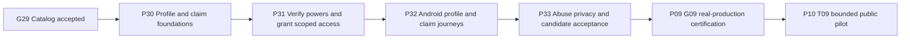

# Station profile and representation delivery plan

State: **PLANNED / LOCAL_ONLY**, 2026-10-02. Authority: maintainer requested the station entity/profile and complete secure representation process. This batch extends the existing local [catalog plan](STATION_CATALOG_PLAN.md), defines [B-BR-P01–P16 / BUC-P01–P10](../product/STATION_PROFILE_REPRESENTATION.md) and adds [P30–P33 tasks](../../ROADMAP.md#station-profile-and-representation). It does not implement runtime behavior, create remote issues/milestones/PRs, publish GitHub/wiki, collect real documents, buy providers or deploy.

## Current evidence and approach

Directory already has a canonical Station UUID, full-CNPJ identifier history and reviewed location revisions (`backend/internal/modules/directory/domain/station.go`). Reuse these; the new public entity is a station profile associated with that station, not a second station registry. Existing account/key binding derives account identity server-side; existing Moderation permits a bounded target enum and restricted operator authority. New claim targets and private signed-document capability must be explicitly introduced/tested; no existing JPEG evidence endpoint is assumed to accept PDF or certificate bundles.

The P24 checkout remains occupied. Continue this planning task in `codex/phase-25-station-catalog-plan`, base `b4f664e`, preserving preceding local P25–P29 edits. Current actual progress is separate from historical PLANNED labels; do not recreate integrated P19–P23. Native iOS remains DEFERRED_EXPLICIT_RESUME_ONLY. This is a coherent documentation extension, not simultaneous execution of catalog and profile runtime phases.

## Outcome and MVP

Every catalog station may have a read-only public profile even without prices or a representative. A free account can privately open `Represento este estabelecimento`, prove identity and authority for the operating company, obtain reviewed narrow permissions, manage permitted business information and reply officially. Use the badge `Representante da empresa verificado`; do not claim property ownership, price correctness or ANP endorsement.

Initial approval combines a request-specific signed declaration, independent official source/authority checks and human review. Supported paths: company certificate with powers/recipient linkage; personal ICP-Brasil/gov.br signature plus current corporate authority or mandate; exceptional manual issuer-verified documents and independent confirmation under equivalent authority criteria. A PDF, selfie, public CNPJ/ANP certificate, corporate email/phone or being on-site is not sufficient alone. Weakening evidence because a source is unavailable is prohibited.

Out of scope: unattended automatic first-claim approval, buying verification priority, permanent document/photo gallery, access to contributors' private media, deleting criticism, regulatory-field overwrite, multi-tenant enterprise architecture and automatic property-title verification. Existing prices/comments/ratings/moderation remain their owning contexts.

## Verified reference facts and implementation constraints

Primary references checked 2026-10-02; reconfirm standards/access at implementation. Design choices below are proposed application policy, not a legal certification.

- Receita's service exposes cadastral information and QSA. That supports identity/role investigation but does not alone establish the applicant's identity, current powers or a mandate's scope. Obtain sources independently; check authentic corporate acts where needed. [Official CNPJ/QSA service](https://www.gov.br/pt-br/servicos/consultar-cadastro-nacional-de-pessoas-juridicas).
- ANP allows consultation of station status and certificate authenticity. It confirms establishment/regulatory data, not that the claimant is entitled to use that company's app profile. [Consulta Posto Web](https://www.gov.br/anp/pt-br/assuntos/distribuicao-e-revenda/revendedor/consulta-posto-web).
- ITI distinguishes the legal-entity certificate holder from its individual responsible user, who may be a legal representative or authorized person. Image copies of handwritten signatures are not cryptographic signatures. Its current FAQ also describes a February 2029 transition ending new A1/A3 legal-entity signature-certificate issuance; verify current rules before rollout and keep personal-signature/authority paths rather than hard-coding permanent e-CNPJ dependence. [ITI certification FAQ](https://www.gov.br/iti/pt-br/acesso-a-informacao/perguntas-frequentes/certificacao-digital).
- VALIDAR checks recognized electronic signatures; it does not certify truth of the declaration or the signer's corporate powers. Its public interface is not assumed to be a private-app automation API or to provide a contractual SLA. [VALIDAR](https://validar.iti.gov.br/), [developer guide](https://validar.iti.gov.br/guia-desenvolvedor.html).
- The published gov.br signing integration is directed to public bodies/entities. MVP may export a document that the person signs externally and returns; do not assume direct gov.br signing/login API eligibility for this private app. [Official integration scope](https://www.gov.br/governodigital/pt-br/identidade/assinatura-eletronica/assinatura-eletronica-para-orgaos).

## Phase order and supersession

Core catalog remains P24 → P25 → P26 → P27 → P29, with P28 complementary sources selected separately. New selected profile scope follows **G29 → P30 → P31 → P32 → P33 → existing P09/G09 → P10-T09**. P33 reaccepts changed Android/backend inputs; earlier G24/G29 evidence applies only where artifacts/configuration/behavior are unchanged. G18 remains unaccepted; no iOS work is resumed.

**P28-T04 is SUPERSEDED_BY_P30_P33**, preserving its ID/history. Owner representation is now explicitly requested and owned here; do not create both implementations/issues. P28-T01–T03 remain optional source/partner work. A partner feed credential never grants profile management or replaces proof of representation.

The earlier catalog production handoff is now a catalog prerequisite, not permission to release before G33 for this selected profile scope. Keep P09 as the sole complete production certification phase; source/API/device/real infrastructure gaps are not waived by a local plan or mock.

## Domain boundaries and proposed schema

Create only the needed packages in a `stationprofile` module within the existing Go monolith, with pure domain and explicit application ports to Directory/account/moderation/evidence/platform. No import of another module's adapters/generated SQL. Operator identity/revision comes from Directory; the module owns profiles/claims/grants and business revisions, not a duplicated CNPJ registry. Existing interfaces are extended only where a selected task demonstrates need.

Proposed logical ownership, finalized with privacy/transition policy in P30-T01 before migrations:

- Directory operating-entity revisions link stable station ID to effective full CNPJ/source/validity; operator projection and applicability version are queryable through a declared port.
- Profile row has unique station ID, policy/schema version, public business projection and optimistic revision. Default unclaimed profile grants nobody privileges.
- Claim row binds requester attribution, station/operator revision, requested role/scopes, state, expected version and server timestamps; duplicate/idempotency rules are explicit. Multiple competing private claims may exist; no one becomes exclusive administrator by submitting first.
- Declaration/proof records have nonce digest, immutable expected-content digest, account/claim/station binding, expiry/consume state and private proof reference. Signed bytes and identity/authority verification results are distinct. Safe denial reason is not a private document dump.
- Decisions, grants, invitations and business revisions use explicit validity/version/supersession and minimal audit references. Unique constraints arbitrate identical scope grants; multiple authorized people are supported under reviewed policy. No contradictory exclusive administrative grant can arise through races.
- Proof storage uses server-generated private keys, fixed expiry, bounded immutable processing and owner/reviewer-only access. Existing photo deadline never resets. Non-photo signed authorization retention, scan/PDF classification, copies/versions, legal purpose and rights must be frozen before storage exists.

Each applied migration is append-only, with empty/previous-schema upgrade, recovery and binary-compatibility evidence. Avoid a document blob in PostgreSQL, arbitrary metadata JSON, tenant ID or personal-data copy in queue payloads. Jobs contain opaque IDs and parser/policy versions. No sensitive fetch/validation while holding locks.

## Claim ceremony and verification

1. Account searches/selects the canonical station, confirms the operator/CNPJ and requested scopes. If the operating entity is unresolved, the claim remains pending Directory verification; identity/authority must not be inferred from the user's declaration.
2. Server creates a private claim and one-use declaration with an account-specific reference, station/CNPJ/operator revision, purpose/scopes, random challenge, issued/expiry times and version. P30-T01 freezes entropy, TTL, quotas, attempt and size limits with threat analysis, not guessed constants.
3. Applicant exports the declaration, signs using their own permitted tool/certificate, and imports the original signed file. Never request the private certificate key/password/PFX/P12 or remote signing credentials. A delegated manager includes a specific verifiable authorization linking their account/person and requested role to the establishment.
4. Bounded private intake checks allowed format/magic/bytes, rejects active content or unsupported encryption/structures safely and hashes original bytes. A PDF viewer/visible stamp cannot assert validity; changing signed bytes by rasterization/compression destroys the evidence. Photographed documents remain under the 24h all-copy cap, even embedded in a PDF.
5. Signature check validates recognized trust chain, exact covered bytes/content, allowed algorithms/format, identity, validity/revocation and applicable time policy. The server matches the expected declaration and account/claim/operator binding. Applicant-supplied validation screenshots/reports are not trusted. Choose a maintained permitted validator or independent restricted operator verification; record source/outcome safely. Indeterminate/provider failure remains unresolved.
6. Independently validate ANP station/operator and CNPJ/corporate powers: full branch vs matrix, current administrators, authentic corporate acts, mandate/delegation expiry and joint-signature requirements. Identify applicant linkage without name-only matching or keeping unnecessary document/biometric copies. A certificate custodian/accountant is not automatically an app administrator.
7. Independent authorized reviewer approves a narrow role/scope, requests fresh information or denies. Recheck current account/operator/proof/version at commit; atomically write decision/grant/idempotency and required publication/notification job. Reviewer cannot approve themselves; concurrent status change invalidates stale review.
8. Applicant sees private progress/reason/appeal path. Public badge uses only current applicable grant projection, with bounded cache freshness. No private person identity or document becomes public. Existing in-app owner status patterns can be reused, but never accept client-side `verified=true`.

Closed claims are terminal; correction, appeal or renewed challenge creates linked new records. A claim/status write is not a grant. Expired evidence cannot become available again because the case is under review. Do not process sensitive evidence through general OCR/LLM services without an explicit separately accepted privacy/rights need.

## Permission and management policy

Proposed roles/scopes freeze in P30-T01; server enforcement arrives before Android buttons:

- Anonymous/free user: public profile reading, normal community participation and signed claim/report submission; no business edit privileges.
- Verified administrator: only approved business-field edits and official replies; delegation proposals only if corporate proof explicitly permits them. High-risk invite/transfer/recovery requires fresh account/key proof and the additional authentication method selected/tested in P30/P31.
- Delegated manager: accepted subset of those capabilities, never broader than their mandate/delegator. Invitation alone is not authority; recipient identity and scope must be linked to verified consent.
- Restricted platform operator: review/suspend/revoke/appeal authority through existing audited CLI/application ports. New station-claim targets/actions require enum/schema/contract tests; profile representation is never a platform moderator role.

Every command rechecks live account/session, grant validity/version, full station scope and current operator revision. Query-time denial cannot wait for a cleanup job. No generic account role `OWNER` that authorizes every station. No static long-lived token or paid entitlement deciding approval. Extra authentication protects administration but cannot replace corporate authority checks.

Business field updates are source-labeled/attributable and optimistic-versioned. Canonical operator/address/geometry corrections go through Directory, not profile edits. Official replies reuse feedback author ownership, 280 Unicode scalar values, reporting/moderation and privacy; new public business attribution requires a tested current-grant check at publication and truthful historical attribution after revocation. Business price submission gets no confidence/ranking/vote advantage. No gallery, deletion of other people's content or private contributor evidence access.

## Contestation, lifecycle and recovery

Competing claims remain private; no automated replacement or exposure of rival documents. Operators evaluate impersonation/authority disputes, use substantiated-risk suspension and issue safe notices through existing approved channels. Reporting alone never suspends a business or assigns access to a competitor. Define staffed response/escalation before pilot; automatic email/SMS services are not invented by this plan.

Transfer requires recipient-specific proof, fresh confirmations and reviewed corporate authority; inviting someone to answer comments is not enough to transfer administration. A manager cannot self-promote. Parent/branch relationship changes, company succession, expired mandate or revoked corporate authority trigger suspension/reverification. Account suspension/deletion or expired/revoked grants deny new privileged writes immediately; deleting the account never deletes the station/community history. Losing the last administrator triggers reviewed recovery, not mutable phone/email proof alone.

Rollback disables the feature or restores a public business projection; it never restores revoked powers. Restore must replay privacy/deletion/revocation decisions and purge expired proof before traffic. Public cache invalidation and TTL must stop stale badge representations within a frozen bound; mutations always consult authority directly. Historical replies retain at-time attribution without implying current representation or exposing private author identity.

## Implementation phases and gates

2026-10-05 override: [ADR-019](../adr/019-android-vps-integration-first.md) executes [P34–P38 app/VPS source work](ANDROID_VPS_PLAN.md) before catalog expansion and this profile scope. Reuse P35 station UUID/detail and P36 accounts/social; do not rebuild them. Source prerequisites consume tested local checkpoints under ADR-018, with per-phase remote PR/CI/merge/wiki deferred to final project closure. P32/P33/P29 device/manual rows join the one end construction acceptance batch and remain OWED until proven.

### P30 — Station profile and private claim foundations

Entry G29, reconciled account/Directory/moderation/media contracts. Branch `codex/phase-30-station-profiles`. Exit **G30**: entities, migrations, public read-only profile, signed claim/declaration and private proof intake pass immediate security/PostGIS/concurrency/contract checks. It grants no management access.

T01 freezes entities, scopes/states, source/provider access, authentication upgrades, limits and document-retention/privacy policy. T02 implements station/operator projection interfaces and unclaimed profile schema/read DTO. T03 implements account-bound claims and one-use declarations. T04 implements bounded private immutable proof intake and deletion/recovery capability, separate from JPEG processing. No actual private documents are collected during planning.

### P31 — Verified representation, permissions and lifecycle

Entry G30 and selected signature/official-source access proven. Branch `codex/phase-31-verified-representation`. Exit **G31**: independent proof/authority review, atomic scoped grants, privileged edit/reply enforcement, contestation/revocation/delegation and erasure/restore pass affected critical tests. Human initial review remains mandatory.

T01 verifies signature/declaration with real approved trust tooling plus failure vectors. T02 verifies applicant/operator/powers and delegated/joint-signature cases independently. T03 adds restricted moderation claim review and atomic grants. T04 enforces business edits/official reply permissions without community privilege escalation. T05 implements reviewed contestation/suspension/revocation and query-time denial. T06 implements scoped invite, recipient proof, transfer/reverification and last-administrator recovery. T07 closes export/erasure/expiry/restore privacy evidence for all new records/objects.

### P32 — Android station profile and claim experience

Entry G31; backend contracts integrated before consumers. Branch `codex/phase-32-station-profile-app`. Exit **G32**: actual profile, claim, status/appeal and representative management flows pass targeted portable/Kotlin/Android/device checks, with no false badge or offline privilege reuse.

T01 implements public profile/source/badge and registry-only no-price/no-representative states. T02 implements free-account claim/declaration export/sign/import with private status and progressive permissions. T03 implements only server-approved business edit/reply/delegation/contest/reverification actions and safe degraded states. T04 proves offline replay, revoked access, canonical targets, accessibility, signed-file bounds and affected low-end device performance. Preserve `com.anpfuel`/MIT/KMP ports and deferred native iOS.

### P33 — Profile fraud, operations and candidate acceptance

Entry G32 and all enabled new providers/contracts/evidence rows. Branch `codex/phase-33-profile-acceptance`. Exit **G33-PROFILE**: fraud/concurrency/lifecycle/privacy/fault/load acceptance plus affected Android reacceptance complete on pinned candidate; P09 still owns real-production edge/storage/provider/restore certification.

T01 executes adversarial/load/review-operations campaign with actual frozen budgets/staffing hypotheses. T02 proves the full profile/claim/authority/appeal/succession/privacy lifecycle and affected device regressions. T03 records candidate/config/proof/provider limitations, operator runbooks and G09/P10 prerequisites. No national fraud-free, instant approval or real production guarantee follows from mocks or a merged phase.

## Required tests and measurable acceptance

Freeze deterministic clocks/IDs and meaningful GIVEN/WHEN/THEN fixtures before domain RED → GREEN → REFACTOR. Immediate critical tests include:

- Same declaration replay or rebound to another account/station/branch; forged certificate chain, revoked/expired proof, wrong signer/CNPJ, unknown revocation/time and signed PDF with altered/unsigned semantic fields.
- Valid signature with no corporate powers, homonymous/masked identifiers, accountant custodian, expired mandate, joint-signature missing party, matrix/filial mismatch, brand/franchise conflation and changed operator while verification runs.
- Malformed/oversize/encrypted/active PDF, multi-file/parse exhaustion, arbitrary URL/SSRF and upload overwrite after verification; private-key bundles rejected. Synthetic fixtures only; real user documents/keys never enter Git/logs.
- Claim IDOR/evidence ownership, deleted/revoked account, requester/reviewer self-approval, concurrent approve/cancel/revoke/transfer, duplicate decision/job and stale grant version. No external request while DB lock is held.
- Manager escalation, expired/unaccepted invite, old admin after succession, cached/offline privileged command after revocation, unverified official-reply labeling and attempts to erase ratings/comments or change price trust.
- All-copy 24h photo/scan expiry, signed document policy expiry, disclosure/cache/log checks, owner export isolation, account erasure and restore purging/revocation replay. Rebinding cannot extend expiry.
- Public profile without prices/representative/location; old-client unknown states, annotation accessibility, blocked signer/provider and manual fallback with equivalent authority requirements.

Use synthetic test trust roots only in test builds and prove they cannot approve release proofs. Public approved signed samples can test cryptographic tooling; fake root fixtures do not prove real ICP-Brasil/gov.br trust. Source/provider smoke and human-review protocol need actual evidence under permitted access; no scraping or CI network dependency is inferred. A future verifier package or CLI is not counted as existing until introduced and tested.

Command building blocks from [TEST_STRATEGY](../backend/TEST_STRATEGY.md) and [backend environment](../../backend/README.md): affected existing Directory/account/moderation/evidence unit/race and disposable real-PostGIS integration; after introduction, actual `stationprofile` packages and migrations. Use existing `go test ./internal/platform/apicontract/...`, OpenAPI lint/compatibility fixtures and root Gradle domain/application/data/app tests/assembly/affected instrumentation. New package paths/commands are frozen and evidenced in each task, never listed as already passing. Every task has `git diff --check`, new-file whitespace and scoped secret review.

P33 freezes workload, hardware, profile-read p95, private verification job memory/concurrency, upload byte/page caps, queue-age/escalation budgets and review throughput before its campaign. Initial synthetic sizing: reuse 100k catalog stations; test 1k claims per day with declared valid/ambiguous mix and a burst of competing claims on one station. These are hypotheses, not actual demand or approved capacity. Use fixture providers for load, never hammer official public tools. Record staff arrival rate × handling time, not an invented headcount. Approval latency includes human review; no 24/48h catalog-insertion objective is repurposed as a claim-approval promise.

## Delivery cadence and decisions to close

ADR-018 supersedes the historical per-phase remote cadence below. Source tasks keep immediate critical tests and local checkpoints; final project closure owns cumulative PR/CI/merge/wiki. ADR-019 owns app-first order; full device/manual/provider acceptance is recorded at the end, never manufactured from local source tests.

One bounded task issue/atomic commit; one phase milestone/branch with local checkpoints; final cumulative PR under ADR-018. Preserve [DELIVERY_WORKFLOW](DELIVERY_WORKFLOW.md) and [CI_PLAN](CI_PLAN.md): immediate targeted risk tests → specialized local source exit/checkpoint → next dependent branch; at final project closure only, `scripts/git-flow.sh finish --required "Quick verification" --pr <actual-number>` → protected current-head/base merge preserving commits → safe merged-branch cleanup → owned wiki mirror once from merged SHA. No direct main development push, force/admin bypass or deferred known failures. Required missing/skipped/failed checks block merge; wiki failures retry docs only. Remote records open only for the authorized current runtime phase, not all future tasks now.

Close before runtime: permitted maintained signature verifier/access/cost/license/security; proof-time/revocation semantics; exact consent/declaration fields and resource/quota limits; equivalent manual proof criteria; authority/delegation/grant-expiry and additional-factor policy; private document categories/retention/erasure/backup treatment; authorized business fields/reply attribution; explicit moderation target/status transitions; named review coverage/escalation. Each decision has an owning P30/P31 task. Unknown access/identity/powers remain unresolved rather than auto-approved.

## Local planning evidence and next action

Planning-only branch `codex/phase-25-station-catalog-plan`, base `b4f664e6b12cb3e053dff6aeb84607dd5dbe5d62`; occupied P24 runtime checkout and preceding catalog plan retained. No P30–P33 task is LOCAL_DONE by the plan. Scoped planning checks PASS: 13 owned Markdown documents, 227 local links/anchors, 38 unique P25–P33 task IDs (18 new profile tasks; P28-T04 superseded), 16 B-BR-P rules and 10 BUC-P use cases, phase/dependency/status consistency, tracked and new-file whitespace/secret-surface review, and `git diff --check`. Backend/device/certificate runtime proof is not claimed for this docs-only batch.

Next runtime steps are P34-T01 app/VPS integration, remaining P34–P38 source tasks, then catalog P25-T01 opening on a verified fresh base; then catalog gates, P30-T01 profile/representation contract freeze and the sequence above. GitHub/wiki publication of local documents remains pending and must not be inferred from these paths.
